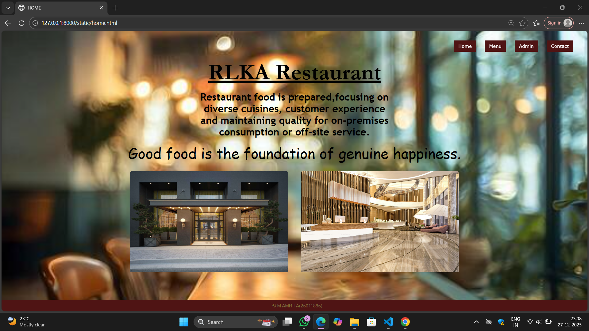
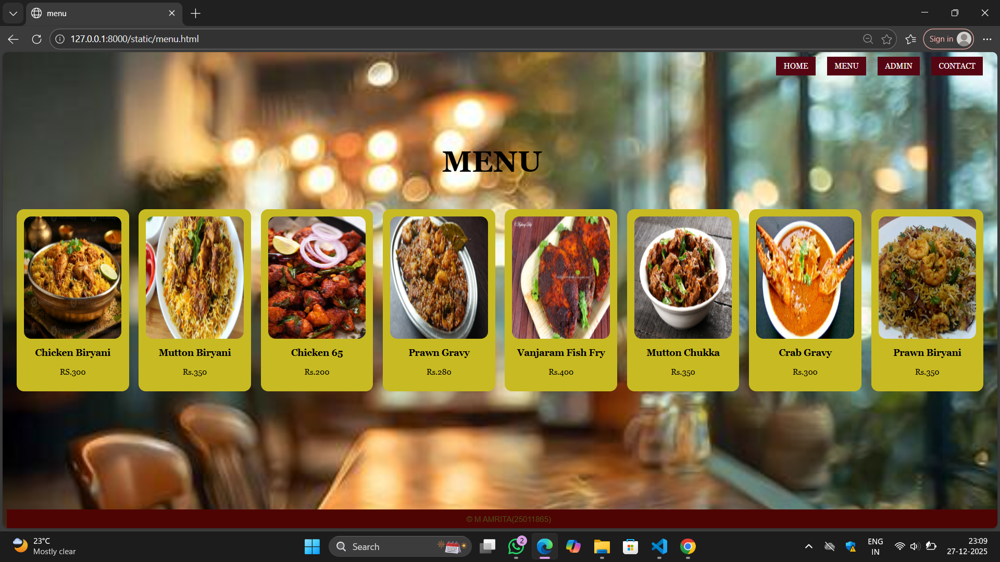
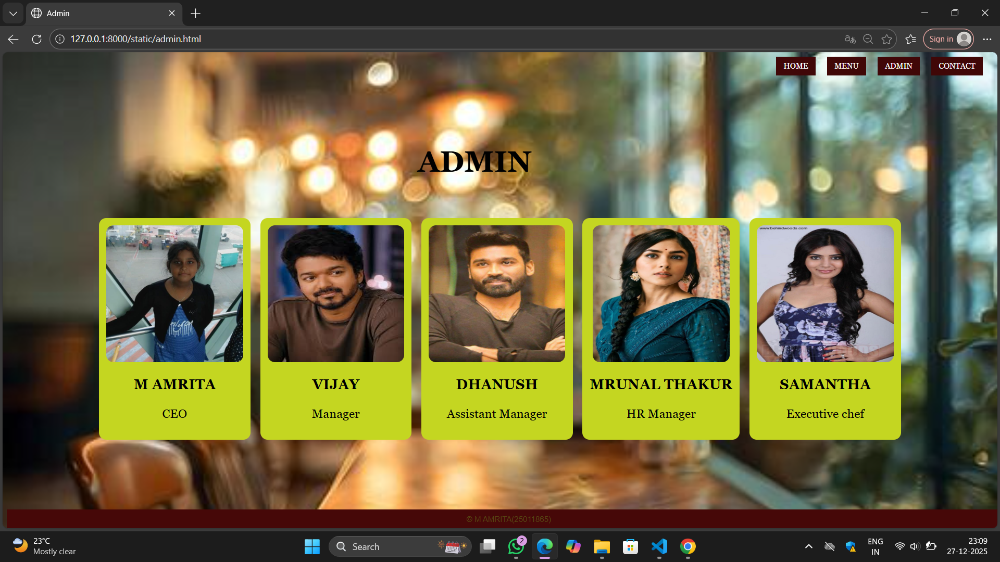
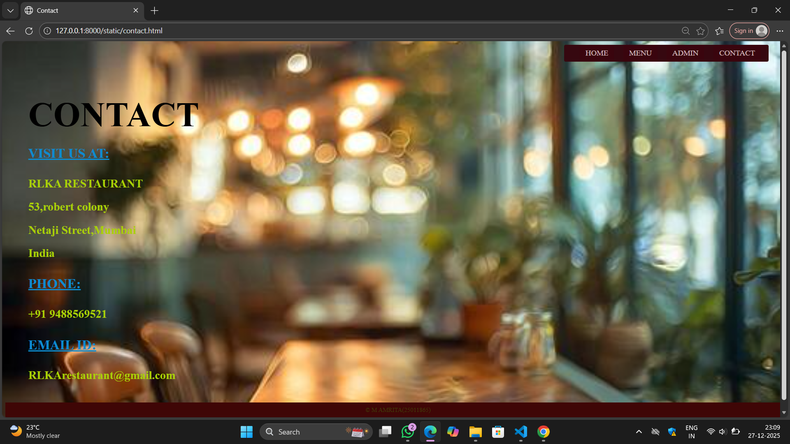

# Ex.06 Restaurant Website
## Date:27-12-2025

## AIM:
To develop a static Restaurant website to display the food items and services provided by them.

## DESIGN STEPS:

### Step 1:
Requirement collection.

### Step 2:
Creating the layout using HTML and CSS.

### Step 3:
Updating the sample content.

### Step 4:
Choose the appropriate style and color scheme.

### Step 5:
Validate the layout in various browsers.

### Step 6:
Validate the HTML code.

### Step 7:
Publish the website in the given URL.

## PROGRAM:
```
home.html
<html>
    <head>
        <title>
            HOME
        </title>
        <link rel="stylesheet" href="home.css">
    </head>
    <body>
        <div class="heading">
            <p><u>RLKA Restaurant<u></u></p>
        </div>
        <div class="vision">
            <p>
                Good food is the foundation of genuine happiness.
            </p>
        </div>
        <div class="about">
            <b>Restaurant food is prepared,focusing on diverse cuisines, customer experience and maintaining quality for on-premises consumption or off-site service.</b>
        </div>
        <div class="header">
            <a href="home.html">Home</a>
            <a href="menu.html">Menu</a>
            <a href="admin.html">Admin</a>
            <a href="contact.html">Contact</a>
        </div>
        <div class="img">
        
        
        </div>
        <div class="footer">&copy; M AMRITA(25011865)</div>
    </body>
</html>

home.css

body{
    background-image: url("b.jpg");
    background-repeat: no-repeat;
    background-position: center;
    background-size: cover;
    margin: 0;
}
.heading{
    position: absolute;
    top: 20px;
    left: 0;
    right: 0;
    text-align: center;
    font-family: Garamond, serif;  
    font-size: 80px;
    font-weight: bolder;
    color:rgb(0, 0, 0); 
}
.about{
    position: absolute;
    top: 210px;
    left: 0;
    right: 0;
    width: 700px;
    margin: auto;
    text-align: center;
    font-family: "Trebuchet MS", sans-serif;
    font-size: 35px;
    color: rgb(0, 0, 0);
}
a:hover{
    background-color:rgb(53, 7, 118);
    color:white;
}
.vision{
    position: absolute;
    top: 340px;
    left: 0;
    right: 0;
    text-align: center;
    font-family: Georgia, serif;
    font-size: 50px;
    font-family: Comic Sans MS;
    color: rgb(0, 0, 0); 
}
.header{
    position: fixed;
    top: 30px;
    right: 50px;
    font-family: Verdana, sans-serif; 
    font-size: 30px;
    color:white;
}
.header a {
    text-decoration: none;
    margin-left: 20px;
    padding: 10px 15px;
    background-color: rgb(79, 20, 20);
    color:white;
    font-size: 16px;
}
.img{
    position: relative;
    top: 470px;
    text-align: center;
}
.img img{
    width: 550px;
    height: 350px;
    margin: 20px;
    border-radius: 5px;
}
.footer{
    position: fixed;
    bottom: 0;
    width: 100%;
    background-color: rgb(79, 20, 20); 
    color: rgb(130, 111, 62); 
    text-align: center;
    font-family: Arial, sans-serif; 
    padding: 10px;
}

menu.html

<html>
<head>
    <title>menu</title>
    <link rel="stylesheet" href="menu.css">
</head>
<body>
    <div class="nav">
        <a href="home.html">HOME</a>
        <a href="menu.html">MENU</a>
        <a href="admin.html">ADMIN</a>
        <a href="contact.html">CONTACT</a>
    </div>
    <h1 class="menu">MENU</h1>
    <br>
    <br>
    <br>
    <div class="container">
        <div class="list">
            
            <h3>Chicken Biryani</h3>
            <p>RS.300</p>
        </div>
        <div class="list">
            
            <h3>Mutton Biryani</h3>
            <p>Rs.350</p>
        </div>
        <div class="list">
            
            <h3>Chicken 65</h3>
            <p>Rs.200</p>
        </div>
        <div class="list">
            
            <h3>Prawn Gravy</h3>
            <p>Rs.280</p>
        </div>
        <div class="list">
            
            <h3>Vanjaram Fish Fry</h3>
            <p>Rs.400</p>
        </div>
        <div class="list">
            
            <h3>Mutton Chukka</h3>
            <p>Rs.350</p>
        </div>
        <div class="list">
            
            <h3>Crab Gravy</h3>
            <p>Rs.300</p>
        </div>
        <div class="list">
            
            <h3>Prawn Biryani</h3>
            <p>Rs.350</p>
        </div>
    </div>
    <div class="footer">&copy; M AMRITA(25011865)</div>
</body>
</html>

menu.css

body{
    background-image: url("b.jpg");
    background-size: cover;
    background-position: center;
    font-family: Georgia, serif;
}


.nav{
    position: absolute;
    top: 20px;
    right: 30px;
}

.nav a{
    text-decoration: none;
    margin-left: 20px;
    padding: 10px 15px;
    background-color:  rgb(86, 6, 19);
    color: WHITE;
    font-size: 16px;
}


.menu{
    position: absolute;
    top: 150px;
    text-align: center;
    left: 900px;
    font-size: 60px;
    color: rgb(0, 0, 0);
}


.container{
    position: relative;
    top: 260px;
    display: flex;
    justify-content: center;
    gap: 20px;
}


.list{
    background-color: rgb(200, 186, 35);
    padding: 15px;
    text-align: center;
    border-radius: 15px;
}

.list img{
    width: 200px;
    height: 250px;
    border-radius: 15px;
}
.footer{
    position: fixed;
    bottom: 0;
    width: 100%;
    background-color: #4f0404; 
    color:rgb(77, 81, 23); 
    text-align: center;
    font-family: Arial, sans-serif; 
    padding: 10px;
}

admin.html

<html>
<head>
    <title>Admin</title>
    <link rel="stylesheet" href="admin.css">
</head>
<body>
    <div class="nav">
        <a href="home.html">HOME</a>
        <a href="menu.html">MENU</a>
        <a href="admin.html">ADMIN</a>
        <a href="contact.html">CONTACT</a>
    </div>
    <h1 class="admin">ADMIN</h1>
    <br>
    <br>
    <br>
    <br>
    <div class="menu">
        <div class="list">
            
            <h3>M AMRITA</h3> 
            <p>CEO</p>
        </div>
        <div class="list">
            
            <h3>VIJAY</h3>
            <p>Manager</p>
            
        </div>
        <div class="list">
            
            <h3>DHANUSH</h3>
            <p> Assistant Manager</p>
        </div>
        <div class="list">
            
            <h3>MRUNAL THAKUR</h3>
            <p>HR Manager</p>
        </div>
        <div class="list">
            
            <h3>SAMANTHA</h3>
            <p>Executive chef</p>
        </div>
    </div>
    <div class="footer">&copy; M AMRITA(25011865)</div>
</body>
</html>

admin.css

body{
    background-image: url("b.jpg");
    background-size: cover;
    background-position: center;
    font-family: Georgia, serif;
}


.nav{
    position: absolute;
    top: 20px;
    right: 30px;
}

.nav a{
    text-decoration: none;
    margin-left: 20px;
    padding: 10px 15px;
    background-color: rgb(64, 7, 7);
    color: white;
    font-size: 16px;
}


.admin{
    position: absolute;
    top: 150px;
    text-align: center;
    left: 850px;
    font-size: 60px;
    color:rgb(0, 0, 0);
}


.menu{
    position: relative;
    top: 260px;
    display: flex;
    justify-content: center;
    gap: 20px;
}


.list{
    background-color:rgb(196, 214, 33);
    padding: 15px;
    text-align: center;
    border-radius: 15px;
    font-size: 25px;
}

.list img{
    width: 280px;
    height:280px;
    border-radius: 15px;
}
 

.footer{
    position: fixed;
    bottom: 0;
    width: 100%;
    background-color: #460808; 
    color: rgb(87, 68, 18); 
    text-align: center;
    font-family: Arial, sans-serif; 
    padding: 10px;
}

contact.html

<html>
<head>
    <title>Contact</title>
    <link rel="stylesheet" href="contact.css">
</head>
<body>
    <div class="nav">
        <a href="home.html">HOME</a>
        <a href="menu.html">MENU</a>
        <a href="admin.html">ADMIN</a>
        <a href="contact.html">CONTACT</a>
    </div>
    </div>
    <div class="contact">
        <h1>CONTACT</h1>
        <div class="Details">
            <h2><u>VISIT US AT:</u></h2>
            <p>
                <b>RLKA RESTAURANT<br>
                53,robert colony<br>
                Netaji Street,Mumbai <br>
                India</b>
            </p>

            <h2><u>PHONE:</u></h2>
            <p><b>+91 9488569521</b></p>

            <h2><u>EMAIL ID:</u></h2>
            <p><b>RLKArestaurant@gmail.com</b></p>
        </div>
    </div>
    <div class="footer">&copy; M AMRITA(25011865)</div>
</body>
</html>

contact.css

body {
    height: 100vh;
    background-image: url("b.jpg");
    background-size: cover;
    background-position: center;
    color: rgb(170, 207, 6);
}

.nav{
    position: absolute;
    top: 10px;
    right: 300x;
    background-color:rgb(54, 8, 16);
    padding: 10px 20px;
    border-radius: 4px;
}

.nav{
    position: absolute;
    top: 10px;
    right: 30px;
}

.nav a{
    text-decoration: none;
    margin-left: 20px;
    padding: 10px 15px;
    background-color:  rgb(58, 5, 14);
    color: rgb(218, 194, 194);
    font-size: 20px;
}

.contact {
    padding: 70px 60px;
}

.contact h1 {
    font-size: 90px;
    color: rgb(0, 0, 0);
    margin-bottom: 30px;
    
}

.details h2 {
    font-size: 35px;
    margin-top: 20px;
    color: rgb(13, 139, 207);
}

.details p {
    font-size: 30px;
    line-height: 2;
    margin-top: 2px;
}
.footer{
    background-color: rgb(63, 6, 6);
    text-align: center;
    color:rgb(65, 63, 8);
    padding:10px;
    bottom: 0;
    width: 100%;
    position:fixed;
    
}
```

## OUTPUT:





## RESULT:
The program for designing software company website using HTML and CSS is completed successfully.
